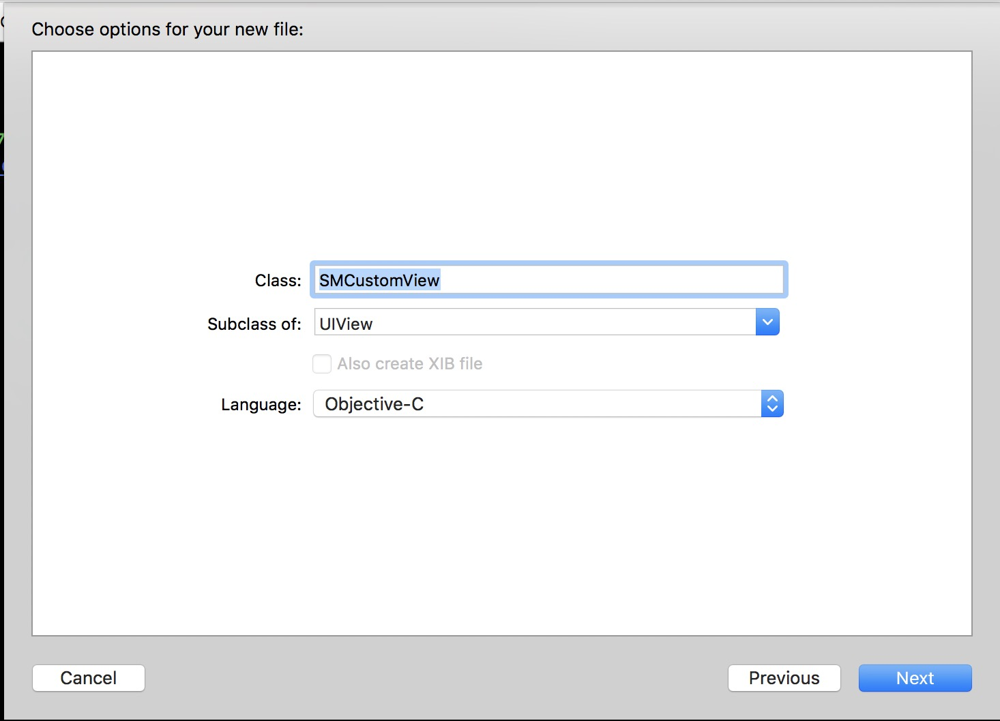
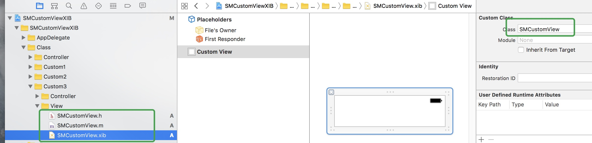
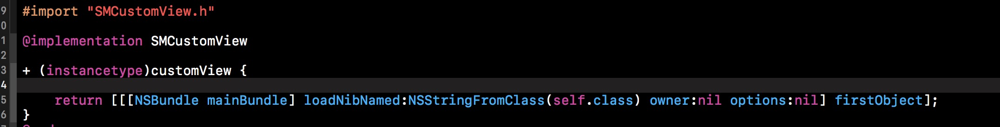
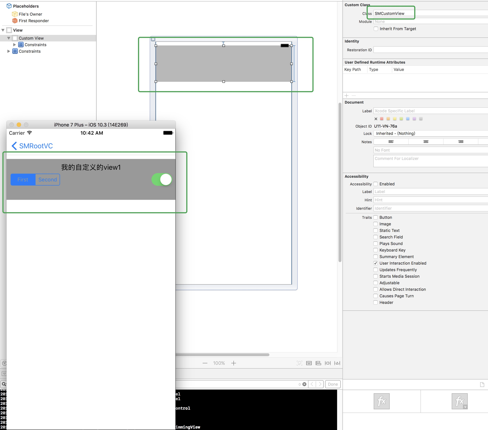
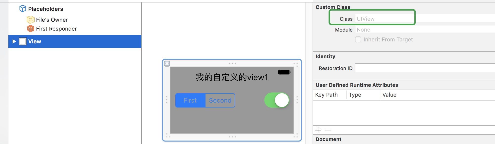
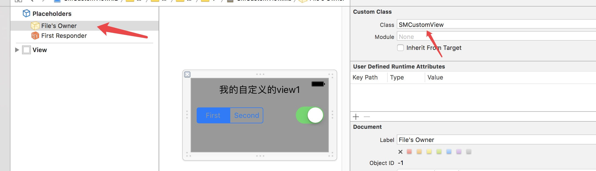
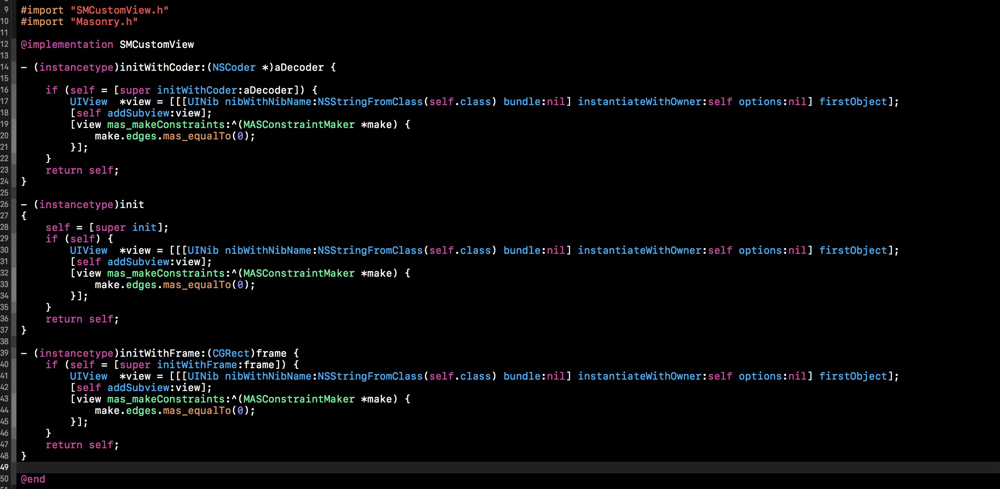
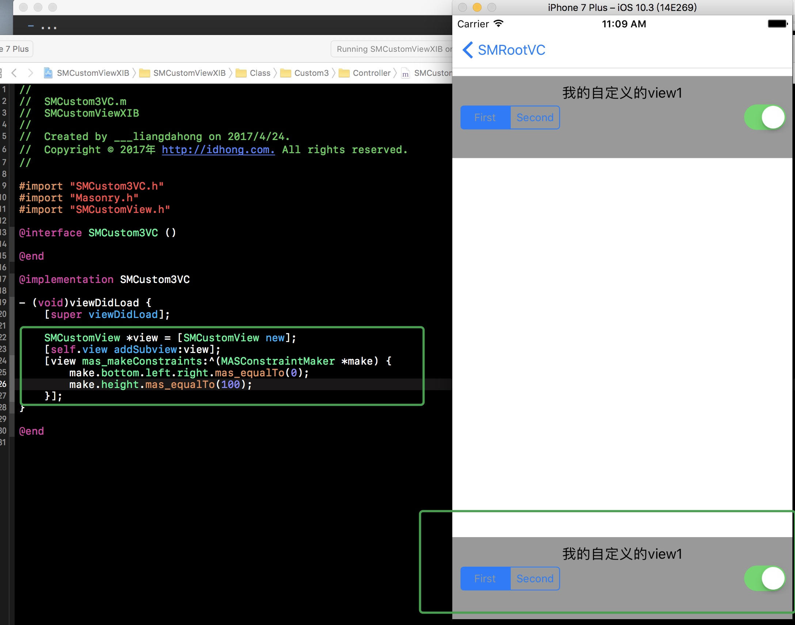
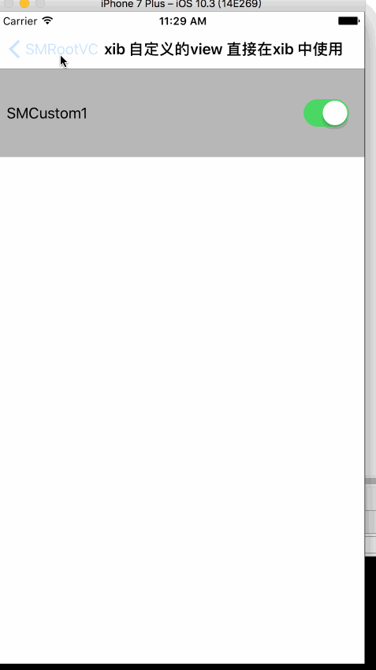

# **Xib** 自定义 **View** 从入门到放弃

> 在 iOS 开发中，特别的搭建 UI 时，用 **Interface Builder** 简直就是一大**神器**，甚至有时候不需要一件代码，只需要 **拖拖拽拽** 就可以完成项目需求。下面从使用 **XIB**自定义**View**说起。

&nbsp;

## Xib自定义的View使用代码添加

- 创建工程，在创建一个 自定义的View 继承于 UIView             

---
- 再创建对应的 Xib 文件             

---
- 在 Xib 上拖拖一些需要自定义的 view           

---
- 在 vc 里面添加自定义的 view            

---
- 运行起来的效果如下：                       

---
- 可以把上面创建自定义view 的代码简单封装一下,为 自定义的view 增加一个类方法      

> 通过上面的代码，基本已经实现了 使用 Xib 自定义 View 的使用。在少量的代码时还是挺方便的，如果项目逐渐增加，可能我们的项目有 自定义的View 越来越多。那么每创建一个 自定义view，提供一个类方法，需要的地方多使用 **addSubview:** 添加。可能的问题总结如下：

---
1. 每创建的自定义View 需要创建类方法（可以使用**Category**简化）
- 每一次需要使用自定义的View 需要 **addSubview:** 方法，然后又需要设置 **frame**（或者使用**Masonry**布局）
- 如果多个自定义view 嵌套时就更加麻烦。
- 不想使用代码布局（**frame**，**Masonry**）
- 我想简化代码
- 使用者使用你的自定义的View，并一定需要使用你提供的类方法，别人想使用 （**new**，**alloc**）等方法
- 使用者想自己在他的xib 上拖拖一个View 改为你自定义的View就可以使用
- ...

---

> 上面的痛点使用上面的方法均无法实现，我们生活可以自定义一个View来，就和系统UI 控件一样使用呢，如：UIButton，UILabel等，想解决这个问题可继续往下看。

## Xib自定义的View ，直接在Xib 里添加
- 效果如下：（没有加一件代码）                                 
  
                               
> 效果已经实现，说一下踩的坑吧。

---

> 首先了解一下下面的方法
> [Apple就解释](https://developer.apple.com/reference/foundation/nscoding/1416145-initwithcoder)  ，[参考2](http://idealife.github.io/2015/10/10/initWithFrame%E5%92%8CinitWithCoder%E7%9A%84%E6%96%B0%E5%8F%91%E7%8E%B0/)    ，[参考3](http://www.starfelix.com/blog/2014/04/13/zheng-que-bian-xie-designated-initializerde-ji-ge-yuan-ze/)

	- (instancetype)initWithCoder:(NSCoder *)aDecoder
使用 xib 创建的view系统会调用上面的方法，使用我们可以在这里做一点操作。

- 把刚才自定义的 View 去掉关联                      

- 使用 file's Owner 关联                                 

- 在 .m 文件重复 **initWithCoder:**方法

		- (instancetype)initWithCoder:(NSCoder *)aDecoder {
		
		    if (self = [super initWithCoder:aDecoder]) {
		        UIView  *view = [[[UINib nibWithNibName:NSStringFromClass(self.class) bundle:nil] instantiateWithOwner:self options:nil] firstObject];
		        [self addSubview:view];
		        [view mas_makeConstraints:^(MASConstraintMaker *make) {
		            make.edges.mas_equalTo(0);
		        }];
		    }
		    return self;
		}
> 入上操作已经完成了 xib 创建 xib 自定义view 的基本操作，上面实际是在 xib 加载时，使用了一个壳来包装自定义的view

## Xib自定义的View ，直接使用 **new** **alloc** 添加

- 在 .m 文件添加如下方法：                                                       

- 添加自定义view时间和运行效果：                      

## 对上面的分析进行封装

- 效果如下：                                                       

## CocoaPods
CocoaPods is the recommended way to add SMCustomViewXIB to your project.

Add a pod entry for SMCustomViewXIB to your Podfile.

	pod 'SMCustomViewXIB', '~> 0.0.2'
		
Second, install SMCustomViewXIB into your project:

	pod install
	
Include SMCustomViewXIB wherever you need it with `#import "SMCustomViewXIB.h"`.
	

Comply with the `SMCustomViewXIBProtocol ` protocol 

## Contacts
##### Sina : [@梁大红](http://weibo.com/3205872327)
##### blog : [@idhong](http://idhong.com/2017/04/23/Xib%E8%87%AA%E5%AE%9A%E4%B9%89View%E4%BB%8E%E5%85%A5%E9%97%A8%E5%88%B0%E6%94%BE%E5%BC%83/)

## License
SMCustomViewXIB is released under the [MIT license](LICENSE). 