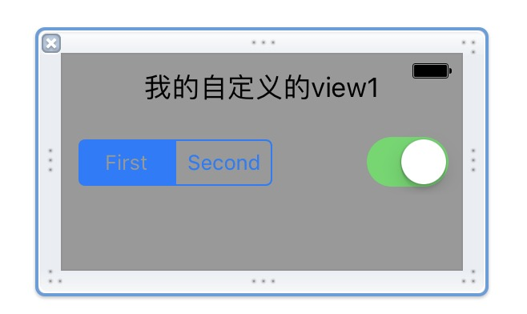
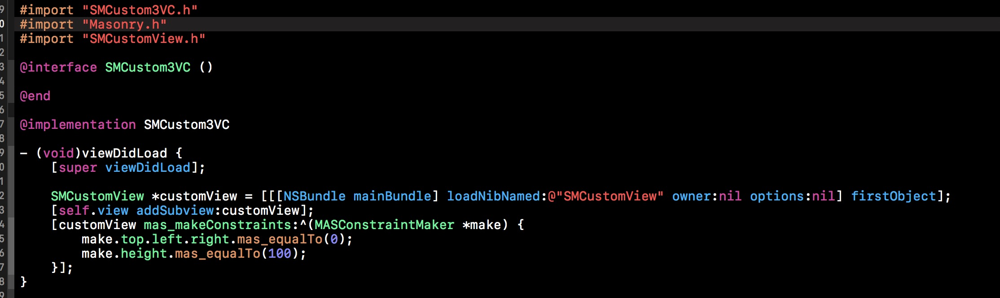
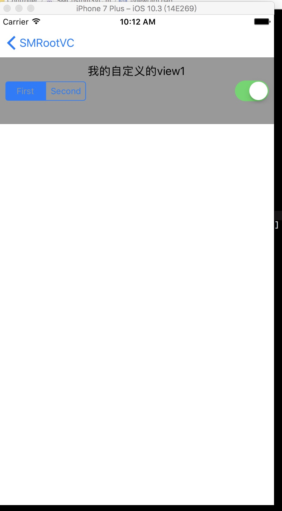

# **Xib** 自定义 **View** 从入门到放弃

> 在 iOS 开发中，特别的搭建 UI 时，用 **Interface Builder** 简直就是一大 **神器**，甚至有时候不需要一件代码，只需要 **拖拖拽拽** 就可以完成项目需求。下面从使用 **XIB** 自定义 **View** 的一些使用。

## Xib 自定义的 View 使用代码添加

- 创建工程，在创建一个 自定义的View 继承于 UIView

- 再创建对应的 Xib 文件

- 在 Xib 上拖拖一些需要自定义的 view

- 在 vc 里面添加自定义的 view 

- 运行起来的效果如下： 

- 可以把上面创建自定义view 的代码简单封装一下,为 自定义的view 增加一个类方法

> 通过上面的代码，基本已经实现了 使用 Xib 自定义 View 的使用。在少量的代码时还是挺方便的，如果项目逐渐增加，可能我们的项目有 自定义的View 越来越多。那么每创建一个 自定义view，提供一个类方法，需要的地方多使用 **addSubview:** 添加。可能的问题总结如下：

1. 每创建的自定义View 需要创建类方法（可以使用**Category**简化）
- 每一次需要使用自定义的View 需要 **addSubview:** 方法，然后又需要设置 **frame**（或者使用**Masonry**布局）
- 如果多个自定义view 嵌套时就更加麻烦。
- 不想使用代码布局（**frame**，**Masonry**）
- 我想简化代码
- 使用者使用你的自定义的View，并一定需要使用你提供的类方法，别人想使用 （**new**，**alloc**）等方法
- 使用者想自己在他的xib 上拖拖一个View 改为你自定义的View就可以使用
- ...

> 上面的痛点使用上面的方法均无法实现，我们生活可以自定义一个View来，就和系统UI 控件一样使用呢，如：UIButton，UILabel等。

## Xib自定义的View ，直接在Xib 里添加
- 效果如下：（没有加一件代码）

